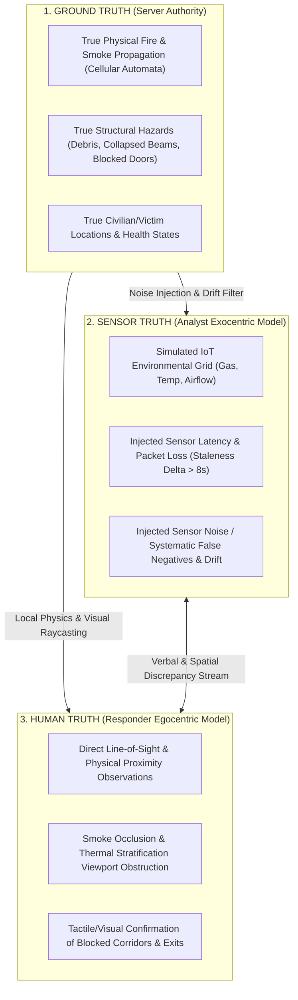
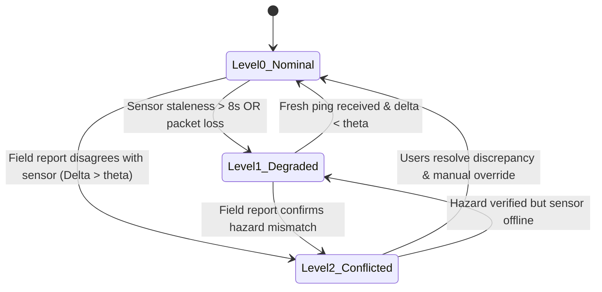
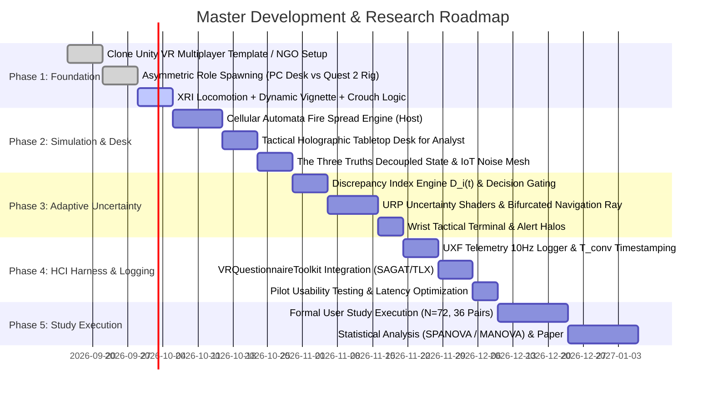

# MASTER PLAN: Asymmetric Adaptive Collaborative VR Emergency Decision-Making System

**Project Title:** Adaptive Uncertainty Visualization in Asymmetric Collaborative Virtual Reality for Emergency Response  
**Target Hardware:** Meta Quest 2 (Snapdragon XR2 Gen 1 Standalone) + PC/Tablet Workstation (Host/Analyst)  
**Primary Engine:** Unity LTS (2022.3 LTS / Unity 6) — Universal Render Pipeline (URP)  
**Status:** Unified Master Specification & Implementation Roadmap  
**Document Version:** 1.0.0 (Synthesized from Research Sessions 1, 2, 3, and 3-Extensions)

---

## 1. Executive Summary & Research Philosophy

### 1.1 Core Scientific Objective
In high-stakes emergency situations (e.g., structural fires, industrial hazardous failures, search-and-rescue), command personnel and field operatives experience stark information asymmetry and varying levels of data uncertainty. Standard VR collaboration either forces users to verbally negotiate every discrepancy or floods visual displays with perpetual error overlays, inducing severe cognitive fatigue.

This project delivers an asymmetric, two-user collaborative VR research platform testing **Adaptive Uncertainty Visualization**:
> **Core HCI Question:** *When, how, and through what visual abstractions should an immersive system automatically expose data conflicts and sensor uncertainty to establish common ground and prevent premature decision closure without causing cognitive overload?*

### 1.2 The Research-First Paradigm
Following the formal design framework from academic collaborative XR:
```
VR Interaction Mechanism ──► Controlled Experimental Manipulation ──► Measurable Human Behavior ──► Scientific Contribution
```
- **Interaction Mechanism:** Allocentric (god-view tabletop) vs. Egocentric (1:1 first-person) asymmetric collaboration with dynamic, context-gated uncertainty visual shaders (isobar confidence shells, bifurcated navigation rays, decaying latency glyphs).
- **Experimental Manipulation:** Within-subject 3×1 Latin-square comparison (Condition A: Deterministic Baseline, Condition B: Static Uncertainty, Condition C: Adaptive Gated Uncertainty).
- **Measurable Behavior:** Decision Convergence Time ($T_{conv}$), SAGAT Shared Situation Awareness, Muir’s System/Interpersonal Trust Scale, NASA-TLX Cognitive Workload, Route Tortuosity, and Unsafe Exposure Duration.
- **Contribution:** Empirical design guidelines and architectural proof that selective, decision-gated uncertainty presentation accelerates team alignment, mitigates unwarranted trust in degraded IoT telemetry, and preserves cognitive bandwidth.

---

## 2. Comparative Synthesis of Foundation Documents

The project architecture consolidates insights across four research sessions:

| Dimension | [Session 1 (`session1.md`)](file:///Users/osman/Desktop/OSMAN_PROJECTS/extended_vurtuality_project/docs/plans/session1.md) | [Session 2 (`session2.md`)](file:///Users/osman/Desktop/OSMAN_PROJECTS/extended_vurtuality_project/docs/plans/session2.md) | [Session 3 (`session3.md`)](file:///Users/osman/Desktop/OSMAN_PROJECTS/extended_vurtuality_project/docs/plans/session3.md) | [Session 3 Ext (`session3_extensions.md`)](file:///Users/osman/Desktop/OSMAN_PROJECTS/extended_vurtuality_project/docs/plans/session3_extensions.md) | **Master Plan Resolution** |
| :--- | :--- | :--- | :--- | :--- | :--- |
| **Primary Scope** | Deep technical blueprint & Quest 2 performance budget | Consolidated roadmap & "Three Truths" conceptual model | Academic curriculum (10 Collaborative VR project catalog) | Pragmatic clone-vs-write implementation guide | **Complete End-to-End System & Experimental Blueprint** |
| **Origin Reference** | System Architecture Blueprint | Synthesized roadmap for "Robert" | **Project 2** ("Emergency Decision-Making") | Package & repo sourcing guide | Synthesizes Project 2 with practical Unity stack |
| **Role Architecture** | Control Analyst (Exocentric) + Field Responder (Egocentric) | PC "Oracle" + VR Player (SpyVR pattern) | User A (Sensors/Map) + User B (Direct observation) | Asymmetric client prefabs (Ubiq/NGO) | **Allocentric Desk Analyst (PC) + Egocentric Responder (Quest 2)** |
| **Locomotion** | Continuous + Dynamic FOV Vignette (45°) + Snap-Turn (30°) | Teleportation (UltimateXR) | General navigation | XRI ContinuousMove + `TunnelingVignetteController` | **Continuous Joystick + XRI Dynamic Tunneling Vignette + Snap Turn** |
| **Physicality** | Headset crouch tracking ($H_{HMD} < 1.25\text{ m}$) for smoke | Not specified | Environmental hazard navigation | Physical floor navigation | **Active Physical Crouch Stratification (<1.25 m thermal threshold)** |
| **Networking** | Unity NGO or Photon Fusion 2 | Photon Fusion, Normcore, SpyVR | Networked two-user VR | Unity VR Multiplayer Template / UCL Ubiq | **Unity Netcode for GameObjects (NGO) + Unity Transport (UTP)** |
| **Data Schema** | Conflict Delta: $\|S_{val} - O_{rep}\| > \theta$ | The "Three Truths" (Ground, Sensor, Human) | Incomplete & contradictory sensor vs. vision | Discrepancy Index equation $D_i(t)$ | **Tripartite State Schema + Quantitative Discrepancy Index** |
| **Uncertainty States** | 3-Level State Machine (Nominal, Degraded, Conflicted) | Proximity & Decision-Point triggers; URP shaders | Condition 3: Uncertainty-Aware Shared Vis | Iso-shells, halos, bifurcated rays | **Tri-Level Adaptive Uncertainty Engine with Decision-Gating** |
| **Study Design** | 3×1 Within-Subjects ($N=72$, 36 pairs) | 2-Condition Within-Subjects (Static vs Adaptive) | 3-Condition (Independent vs Shared vs Uncertainty) | SAGAT freeze trigger & JSON logging | **3×1 Counterbalanced Latin-Square ($N=72$, 36 pairs, 3 Conditions)** |

---

## 3. Data Schema: The "Three Truths" Framework

To force active collaborative negotiation, the master simulation maintains three decoupled state models:



1. **Ground Truth ($S_{GT}$):** Maintained exclusively on the central authority (Host). Computes physical spread, structural integrity, and actual casualty states.
2. **Analyst Sensor Truth ($S_{Analyst}$):** Synthesized from a noisy, simulated IoT telemetry mesh. Features sensor degradation (e.g., heat sensor reporting room clear due to wire severance, or delayed propagation data).
3. **Responder Human Truth ($O_{Responder}$):** Direct first-person sensory ground reality. The responder physically encounters unmapped rubble or localized flashovers, contradicting the analyst's dashboard.

---

## 4. System Architecture Blueprint

```
                     ┌────────────────────────────────────────────────────────┐
                     │              CENTRAL SIMULATION AUTHORITY              │
                     │   • Cellular Automata Fire / Smoke Propagation Engine  │
                     │   • Physical Ground-Truth States (Blocked Exits, Debris│
                     │   • Noise-Injected Sensor Matrix (IoT Thermal / Gas)   │
                     └───────────────────────────▲────────────────────────────┘
                                                 │
                     State Replication via Low-Latency Network Broker
                     (Unity Netcode for GameObjects / Unity Transport)
                                                 │
                ┌────────────────────────────────┴────────────────────────────────┐
                ▼                                                                 ▼
┌───────────────────────────────┐                                 ┌───────────────────────────────┐
│    ROLE 1: CONTROL ANALYST    │                                 │   ROLE 2: FIELD RESPONDER     │
│       (Exocentric Macro)      │                                 │      (Egocentric Micro)       │
├───────────────────────────────┤                                 ├───────────────────────────────┤
│ • Holographic Tabletop Twin   │                                 │ • 1:1 First-Person Scale      │
│ • Historical Trend Heatmaps   │                                 │ • Stratified Smoke / Heat FX  │
│ • Telemetry Health Indicators │                                 │ • Physical Posture & Crouch   │
│ • Macro Waypoint Dispatch     │                                 │ • Wrist Tactical Terminal     │
└───────────────┬───────────────┘                                 └───────────────┬───────────────┘
                │                                                                 │
                │              Two-Way Discrepancy & Agreement Stream             │
                └────────────────────────► ◄──────────────────────────────────────┘
                                           │
                                           ▼
                ┌─────────────────────────────────────────────────────────────────┐
                │                    ADAPTIVE CONFLICT ENGINE                     │
                │ • Compares Telemetry vs. Ground-Truth Line-of-Sight             │
                │ • Discrepancy Index: D_i(t) = |Sensor_Val - Field_Obs| > theta  │
                │ • Spatial Proximity & Decision-Point Context Gating             │
                └──────────────────────────┬──────────────────────────────────────┘
                                           │
              State-Driven Adaptive Uncertainty Rendering Pipeline (URP)
                                           │
      ┌────────────────────────────────────┴────────────────────────────────────┐
      ▼                                                                         ▼
[Analyst Viewport (PC/Desk)]                                           [Responder Viewport (Quest 2)]
• Isobar Confidence Shells                                             • Bifurcated Navigation Rays
• Stale Ping Latency Counters                                          • Hazard Perimeter Warning Halos
• Probability Spread Cones                                             • Degradation & Ghosting Shaders
                                           │
                                           ▼
┌─────────────────────────────────────────────────────────────────────────────────────────────────┐
│                               HCI RESEARCH & EVALUATION HARNESS                                 │
│ • UXF (Unity Experiment Framework): Continuous 10 Hz Trajectory, Gaze, & Interaction Logging    │
│ • In-Headset SAGAT Freeze-Frames, NASA-TLX Workload, & Muir's Trust Assessment Forms           │
│ • Telemetry: Decision Convergence Time (T_conv), Path Tortuosity, Thermal Exposure Time         │
└─────────────────────────────────────────────────────────────────────────────────────────────────┘
```

---

## 5. Dual-Role Mechanics & Physicality Specifications

### 5.1 Role 1: Control-Room Analyst (Exocentric "God-View")
- **Display & Hardware:** High-resolution Desktop Monitor / Interactive Surface (PC Client).
- **Virtual Viewport:** A 1:20 scaled holographic architectural miniature resting on an interactive tactical table.
- **Controls & Manipulation:**
  - Pan, orbital rotation, and sectional floor elevation slicing using mouse/pointer.
  - Spatial ray interactor to designate waypoints, assign zone priorities, and toggle IoT telemetry streams.
- **Asymmetric Knowledge:** Comprehensive macro-layout, room ambient temperatures, automated suppression sprinkler states, and modeled fire spread vectors. Blind to localized debris barricades, door latch jamming, and stratified smoke visibility.

### 5.2 Role 2: Field Responder (Egocentric First-Person)
- **Display & Hardware:** Meta Quest 2 Standalone VR Headset.
- **Virtual Viewport:** Immersive 1:1 physical perspective inside the compromised structure.
- **Locomotion System:**
  - **Left Thumbstick:** Continuous translation with automatic dynamic tunneling vignette (aperture constricts to $45^\circ$ during acceleration to eliminate optical flow vection).
  - **Right Thumbstick:** Instantaneous snap-turning at calibrated $30^\circ$ steps.
- **Physical Crouch Stratification:**
  - Continuous vertical HMD tracking ($H_{HMD}$).
  - **Thermal/Smoke Ceiling Threshold:** Set at $1.25\text{ m}$ from the tracked floor.
  - **Upright Stance ($H_{HMD} > 1.25\text{ m}$):** Dense particulate soot viewport overlay, heavy breathing/coughing spatial audio cues, and continuous stamina/air tank depletion.
  - **Physical Low Crawl ($H_{HMD} \le 1.25\text{ m}$):** Viewport clears, breathing stabilizes, air consumption normalizes. Directly reinforces realistic structural firefighting protocols.
- **Wrist Tactical Terminal:** Virtual forearm mount presenting localized heading, current waypoint prompt from analyst, environmental oxygen percentage, and immediate proximity alerts.

---

## 6. The Adaptive Uncertainty Engine & State Logic

### 6.1 Mathematical Formulation
For each monitored zone or path segment $i$ at timestamp $t$, the system computes the **Discrepancy Delta**:
$$\Delta_i(t) = |S_i(t) - O_i(t)|$$
Where $S_i(t)$ represents the normalized IoT sensor reading and $O_i(t)$ represents verified responder visual line-of-sight telemetry.

A conflict triggers when:
$$\Delta_i(t) > \theta_{\text{conflict}} \quad \text{OR} \quad (t - t_{\text{last\_ping}}) > \tau_{\text{stale}}$$
*(Default calibration: $\theta_{\text{conflict}} = 0.35$, $\tau_{\text{stale}} = 8.0\text{ seconds}$)*.

### 6.2 Context & Decision-Point Gating
Visualizations do not fire globally. They are **context-gated** by:
1. **Spatial Proximity:** Active only when the Responder is within a decision radius ($R_{\text{prox}} \le 4.0\text{ m}$) of an intersection or door.
2. **Analyst Dispatch Intent:** Active when the Analyst highlights or commits a waypoint route through an unverified zone.

### 6.3 Three-Tier Uncertainty State Machine



#### Level 0: Nominal State
- **Trigger:** Sensor packet loss $< 2\text{ s}$; sensor readings match responder path observations ($\Delta_i(t) \le \theta$).
- **Analyst Vis:** Solid green waypoint paths, sharp geometric building borders, stable telemetry badges.
- **Responder Vis:** Continuous clean green navigation corridor, crisp waypoint icons, unobstructed path cues.

#### Level 1: Degraded / Unverified State
- **Trigger:** Sensor age exceeds staleness threshold ($> 8\text{ s}$) or telemetry packet drops detected.
- **Analyst Vis:** Isobar confidence shells soften; semi-transparent animated boundary fuzziness; pulsating latency clock glyph (e.g., `[!] Telemetry Stale: 11s`).
- **Responder Vis:** Waypoint edges blur; semi-translucent ghosting on projected path markers; amber caution perimeter glow.

#### Level 2: Conflicted / High Divergence State
- **Trigger:** Field report directly contradicts sensor telemetry (e.g., IoT sensor reports "Path Clear", but ground truth has fallen structural beam; or sensor reports $350^\circ\text{C}$ but path is passable).
- **Analyst Vis:** Route splits into a bifurcated ray (intended route turns dashed amber; alternative safe egress route computes in solid blue); spatial notification rings pulse at the exact conflict locus.
- **Responder Vis:** **Bifurcated Navigation Ray** on floor: intended route splits into dashed amber path with "UNCONFIRMED / HAZARD DETECTED" halo, while secondary safe alternate path highlights; spatial warning pulse emitted at doorway.

---

## 7. What to Clone vs. What to Write (Implementation Architecture)

Following the analysis in Session 3 Extensions, the project utilizes battle-tested open-source templates and packages to avoid redundant baseline development:

| Subsystem | Clone / Import Foundation | Custom Code to Implement |
| :--- | :--- | :--- |
| **Networking & Session Host** | **Unity VR Multiplayer Template** (`com.unity.template.vr-multiplayer`) or **UCL Ubiq** (`UCL-VR/ubiq`) | Custom role handshake: assign Client 0 as PC Analyst and Client 1 as Quest 2 Responder upon connection; sync custom simulation state structs. |
| **XR Rigs & Locomotion** | **XR Interaction Toolkit (XRI 3.x)**: `ContinuousMoveProvider` + `TunnelingVignetteController` | Crouch detection logic sampling `Camera.main.transform.localPosition.y` against $1.25\text{ m}$; stamina/coughing audio trigger scripts. |
| **Tactile Desk & UI** | Unity World-Space Canvas UI Prefabs + XRI Ray Interactor | Tabletop miniature scaling matrix, raycast floor slicer, macro waypoint dispatch RPCs sent to Responder. |
| **Fire & Particle Baseline** | **FireEx VR** (Open-source fire simulation baseline) | Optimized mobile URP unlit particle cards with vertex wobble for Quest 2 smoke; cellular automata grid propagation script on Host. |
| **Uncertainty Shaders** | Unity Shader Graph (URP) | Custom volumetric depth-fade blur, edge-fuzziness noise shader, bifurcated navigation ray procedural mesh generator. |
| **HCI Logging & Metrics** | **UXF (Unity Experiment Framework)** + **VRQuestionnaireToolkit** | SAGAT pause freeze-frame triggers, screen fade-to-neutral gray script, decision convergence timestamp recorder ($T_{conv}$), CSV/JSON exporter. |

---

## 8. Scientific Study Design & Experimental Protocol

### 8.1 Experimental Design
- **Structure:** Within-Subjects $3 \times 1$ Factorial Design.
- **Sample Size:** $N = 72$ participants (36 matched dyads).
- **Balancing:** $3 \times 3$ Latin-Square counterbalancing across conditions and scenario difficulty blocks (Warehouse Fire, Chemical Plant Leak, High-Rise Office Evacuation) to eliminate order and fatigue bias.

```
                    36 Participant Dyads (N = 72)
                                 │
                 Standardized In-VR Locomotion & Tutorial
                                 │
     ┌───────────────────────────┼───────────────────────────┐
     ▼                           ▼                           ▼
[Condition A: Baseline]    [Condition B: Static]       [Condition C: Adaptive]
Binary deterministic data; All confidence bounds &      Visualizations adaptively
conflicts remain hidden    uncertainty envelopes        trigger only upon spatial
until physical encounter.  render continuously.         divergence or decision gates.
     │                           │                           │
     └───────────────────────────┼───────────────────────────┘
                                 │
          Multi-Metric Evaluation Capture (Per Condition)
```

### 8.2 Experimental Conditions
1. **Condition A (Deterministic Baseline):** Standard crisp UI. No uncertainty or degradation shown. Conflicting data surfaces only when the Responder physically hits a dead-end or hazard.
2. **Condition B (Static Always-On Uncertainty):** All sensor confidence bands, error envelopes, and stale timestamps are rendered persistently across all rooms and routes regardless of proximity.
3. **Condition C (Adaptive Gated Uncertainty):** The system dynamically activates uncertainty visual cues (bifurcated rays, isobar shells) only when discrepancy exceeds $\theta$ AND the responder approaches the decision boundary ($< 4\text{ m}$).

### 8.3 Core Hypotheses
- **H1 (Efficiency):** Condition C yields significantly shorter Decision Convergence Times ($T_{conv}$) and route tortuosity compared to Condition A, without the high cognitive workload of Condition B.
- **H2 (Cognitive Workload):** Condition B produces significantly higher NASA-TLX scores than Conditions A and C due to constant visual clutter and information overload.
- **H3 (Trust Calibration):** Condition C demonstrates significantly higher appropriate trust (Muir’s Scale) in IoT telemetry—mitigating automation complacency without causing complete system abandonment.
- **H4 (Situational Awareness):** SAGAT freeze-frame spatial recall scores are highest in Condition C, proving that targeted doubt sharpens active mental model alignment.

### 8.4 Multi-Metric Evaluation Battery

#### 1. Objective Behavioral Metrics (Logged at 10 Hz via UXF)
- **Decision Convergence Time ($T_{conv}$):** Duration from initial discrepancy emergence until both users confirm the correct revised route.
- **Route Tortuosity:** Ratio of actual distance traversed by Responder to the theoretical optimal safe path:
  $$\text{Tortuosity} = \frac{L_{\text{actual}}}{L_{\text{optimal}}}$$
- **Hazard Exposure Time:** Total seconds spent in superheated ($>100^\circ\text{C}$) or low-oxygen ($<15\%\text{ O}_2$) zones.
- **Communication Density:** Frequency and word count of verbal coordination, clarification queries, and route confirmations.

#### 2. In-VR Subjective Questionnaires (VRQuestionnaireToolkit)
- **Shared Situation Awareness (SAGAT):** Two random freeze-frames per trial. Screen fades to $50\%$ neutral gray; both users independently plot active fire boundaries, blocked corridors, and survivor locations on a 2D floorplan.
- **Cognitive Workload (NASA-TLX):** Post-block self-assessment measuring Mental Demand, Physical Demand, Temporal Demand, Performance, Effort, and Frustration.
- **Trust in System & Partner (Modified Muir’s Trust Scale):** Evaluates Responder’s trust in sensor telemetry versus analyst verbal guidance across Competence, Predictability, and Dependability dimensions.

---

## 9. Mobile VR (Meta Quest 2) Optimization Budget

To maintain compliance with Oculus Store guidelines and prevent cybersickness, the standalone Quest 2 client must maintain a rock-solid **72 Hz refresh rate** ($\le 13.88\text{ ms}$ per frame).

```
┌────────────────────────┬────────────────────────────────────────────────────────┐
│ Metric                 │ Maximum Target Budget (Snapdragon XR2 Gen 1)          │
├────────────────────────┼────────────────────────────────────────────────────────┤
│ Target Framerate       │ Locked 72 FPS (Max Frame Time: 13.88 ms)               │
│ Draw Calls             │ ≤ 150 draw calls per frame                             │
│ Triangle Count         │ ≤ 250,000 active triangles in any camera frustum        │
│ Rendering Pipeline     │ Universal Render Pipeline (URP)                        │
│ Stereo Rendering Mode  │ Single-Pass Instanced (processes stereo in 1 pass)     │
│ Texture Compression    │ ASTC 6x6 (Max 2048x2048 for hero assets, 1024 normal)   │
│ Lighting & Shadows     │ Statically baked lightmaps; dynamic shadows disabled;  │
│                        │ Projected ambient occlusion & blob contact shadows     │
│ Particle Management    │ Zero alpha-blended fullscreen quads; depth-faded       │
│                        │ stylized geometric smoke cards with vertex animation   │
└────────────────────────┴────────────────────────────────────────────────────────┘
```

---

## 10. Phased Implementation Roadmap



### Phase Breakdown
1. **Phase 1 — Core Networking & Rigs (Weeks 1–2):** Import Unity VR Multiplayer Template; configure client role allocation; build Quest 2 continuous locomotion with dynamic FOV vignette; code physical crouch detection ($H_{HMD} < 1.25\text{ m}$).
2. **Phase 2 — Simulation & Asymmetric Environments (Weeks 3–5):** Build Host cellular automata fire spread; construct low-poly Synty modular industrial facility; build Analyst 3D tabletop interaction with Section/Floor slicing.
3. **Phase 3 — Adaptive Uncertainty Engine (Weeks 6–7):** Program Discrepancy Index $\Delta_i(t)$; implement Level 0/1/2 state machine; build URP bifurcated navigation ray and edge-fuzziness uncertainty shaders.
4. **Phase 4 — HCI Harness & Quest 2 Profiling (Weeks 8–9):** Integrate UXF for 10 Hz trajectory tracking; script SAGAT freeze-frames and NASA-TLX UI; profile with Meta Quest Developer Hub to lock 72 FPS within 150 draw calls.
5. **Phase 5 — User Study & Analysis (Weeks 10–12):** Run 36 dyads through Latin-Square conditions; export CSV telemetry; perform mixed-model repeated measures ANOVA (RM-ANOVA) on $T_{conv}$, SAGAT, TLX, and Muir's Trust; compile academic publication.

---

## 11. Traceability & Source File Cross-Reference

- **Base System Blueprint & State Machine:** [session1.md](file:///Users/osman/Desktop/OSMAN_PROJECTS/extended_vurtuality_project/docs/plans/session1.md)
- **Conceptual Synthesis & "Three Truths":** [session2.md](file:///Users/osman/Desktop/OSMAN_PROJECTS/extended_vurtuality_project/docs/plans/session2.md)
- **Academic Research Taxonomy & Project 2 Specification:** [session3.md](file:///Users/osman/Desktop/OSMAN_PROJECTS/extended_vurtuality_project/docs/plans/session3.md)
- **Open-Source Clone vs. Write Recommendations:** [session3_extensions.md](file:///Users/osman/Desktop/OSMAN_PROJECTS/extended_vurtuality_project/docs/plans/session3_extensions.md)
