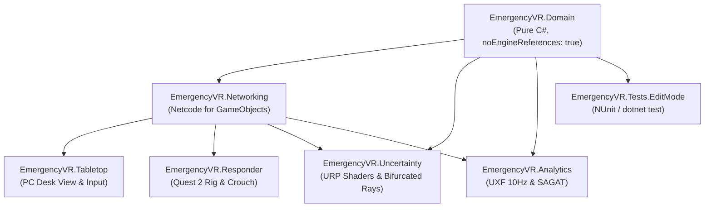

# Technical Realization & Engineering Guide: Asymmetric Adaptive Collaborative VR System

**Target Engine:** Unity 2022.3 LTS (Recommended: 2022.3.28f1+) or Unity 6 LTS (`6000.4.5f1`)  
**Target Runtimes:** Meta Quest 2 Standalone (Android / Snapdragon XR2 Gen 1) + PC Desktop (Windows/macOS Standalone Host)  
**Render Pipeline:** Universal Render Pipeline (URP) — Single-Pass Instanced  
**Networking Model:** Listen-Server Topology via Unity Netcode for GameObjects (NGO) + Unity Transport (UTP)  
**Architecture Standard:** Isolated `_Project/` Container, Modular Assembly Definitions (`.asmdef`), Pure C# Domain Engine (`noEngineReferences: true`), and C# 10 File-Scoped Namespaces  
**Status:** Upgraded Production Realization Manual (Incorporating `WhoWhoo3D_2` Gold Standards)  
**Complementary Document:** [Master Plan (Theoretical & Experimental Overview)](file:///Users/osman/Desktop/OSMAN_PROJECTS/extended_vurtuality_project/docs/plans/master_plan.md)

---

## 1. Upgraded Project Directory Architecture (`_Project/` Isolation)

To prevent third-party packages (Synty Studios, Meta XR SDK, UXF, VRQuestionnaireToolkit) from cluttering custom code, all proprietary scripts, prefabs, materials, and shaders reside inside `Assets/_Project/`.

```
extended_vurtuality_project/
├── Assets/
│   ├── _Project/                           <-- ALL PROPRIETARY WORK LIVES HERE
│   │   ├── Runtime/
│   │   │   ├── Domain/                     <-- Pure C# (noEngineReferences: true)
│   │   │   │   ├── CellularAutomataGrid.cs
│   │   │   │   ├── DiscrepancyCalculator.cs
│   │   │   │   ├── SimulationModels.cs
│   │   │   │   ├── EmergencyVR.Domain.asmdef
│   │   │   │   └── csc.rsp
│   │   │   ├── Networking/                 <-- Netcode synchronization & state
│   │   │   │   ├── NetworkRoleManager.cs
│   │   │   │   ├── SimulationDataStructs.cs
│   │   │   │   ├── EmergencyVR.Networking.asmdef
│   │   │   │   └── csc.rsp
│   │   │   ├── Tabletop/                   <-- PC Analyst miniature controls
│   │   │   │   ├── AnalystTabletopController.cs
│   │   │   │   ├── FloorElevationSlicer.cs
│   │   │   │   ├── EmergencyVR.Tabletop.asmdef
│   │   │   │   └── csc.rsp
│   │   │   ├── Responder/                  <-- Quest 2 VR locomotion & physical crouch
│   │   │   │   ├── PhysicalCrouchTracker.cs
│   │   │   │   ├── WristTerminalController.cs
│   │   │   │   ├── EmergencyVR.Responder.asmdef
│   │   │   │   └── csc.rsp
│   │   │   ├── Uncertainty/                <-- Shaders & adaptive visual feedback
│   │   │   │   ├── AdaptiveUncertaintyManager.cs
│   │   │   │   ├── BifurcatedPathRenderer.cs
│   │   │   │   ├── SensorTelemetryMatrix.cs
│   │   │   │   ├── EmergencyVR.Uncertainty.asmdef
│   │   │   │   └── csc.rsp
│   │   │   └── Analytics/                  <-- UXF logging & SAGAT freeze manager
│   │   │       ├── ExperimentTelemetryLogger.cs
│   │   │       ├── SagatFreezeManager.cs
│   │   │       ├── EmergencyVR.Analytics.asmdef
│   │   │       └── csc.rsp
│   │   ├── Tests/
│   │   │   ├── EditMode/                   <-- Fast pure C# unit tests
│   │   │   │   ├── CellularAutomataTests.cs
│   │   │   │   ├── DiscrepancyCalculatorTests.cs
│   │   │   │   ├── EmergencyVR.Tests.EditMode.asmdef
│   │   │   │   └── csc.rsp
│   │   │   └── PlayMode/
│   │   ├── Prefabs/
│   │   ├── Materials/
│   │   ├── Shaders/
│   │   ├── Scenes/
│   │   └── Settings/
│   ├── ThirdParty/                         <-- Imported packages (Synty, UXF, Toolkit)
│   └── StreamingAssets/
│       └── Maps/
│           ├── facility_warehouse_01.json
│           └── facility_chemical_02.json
├── Packages/
│   ├── manifest.json
│   └── packages-lock.json
└── ProjectSettings/
```

---

## 2. Assembly Definitions (`.asmdef`) & C# 10 Setup

Dividing the project into modular assemblies guarantees fast incremental compilation, enforces clean architectural boundaries, and enables automated headless unit testing.



### 2.1 Assembly Specifications

#### 1. `EmergencyVR.Domain.asmdef`
* **Path:** `Assets/_Project/Runtime/Domain/EmergencyVR.Domain.asmdef`
* **Configuration:**
  ```json
  {
    "name": "EmergencyVR.Domain",
    "rootNamespace": "EmergencyVR.Domain",
    "references": [],
    "includePlatforms": [],
    "excludePlatforms": [],
    "allowUnsafeCode": false,
    "overrideReferences": false,
    "precompiledReferences": [],
    "autoReferenced": true,
    "defineConstraints": [],
    "versionDefines": [],
    "noEngineReferences": true
  }
  ```
  *(Note: `"noEngineReferences": true` strictly prevents any reference to `UnityEngine.dll`, ensuring 100% pure C# logic).*

#### 2. `EmergencyVR.Networking.asmdef`
* **Path:** `Assets/_Project/Runtime/Networking/EmergencyVR.Networking.asmdef`
* **References:** `["EmergencyVR.Domain", "Unity.Netcode.Runtime", "Unity.Collections", "Unity.InputSystem"]`

#### 3. `EmergencyVR.Responder.asmdef`
* **Path:** `Assets/_Project/Runtime/Responder/EmergencyVR.Responder.asmdef`
* **References:** `["EmergencyVR.Domain", "EmergencyVR.Networking", "Unity.XR.Interaction.Toolkit", "Unity.XR.CoreUtils", "Unity.InputSystem"]`

#### 4. `EmergencyVR.Tabletop.asmdef`
* **Path:** `Assets/_Project/Runtime/Tabletop/EmergencyVR.Tabletop.asmdef`
* **References:** `["EmergencyVR.Domain", "EmergencyVR.Networking", "Unity.InputSystem"]`

#### 5. `EmergencyVR.Uncertainty.asmdef`
* **Path:** `Assets/_Project/Runtime/Uncertainty/EmergencyVR.Uncertainty.asmdef`
* **References:** `["EmergencyVR.Domain", "EmergencyVR.Networking", "Unity.RenderPipelines.Universal.Runtime"]`

#### 6. `EmergencyVR.Analytics.asmdef`
* **Path:** `Assets/_Project/Runtime/Analytics/EmergencyVR.Analytics.asmdef`
* **References:** `["EmergencyVR.Domain", "EmergencyVR.Networking", "UXF", "Unity.TextMeshPro"]`

### 2.2 Modern C# 10 Conventions (`csc.rsp`)
To enable modern C# 10 syntax (file-scoped namespaces: `namespace EmergencyVR.Domain;`) across all assemblies, place a `csc.rsp` file in every folder that contains an `.asmdef`:
```
-langversion:latest
```

---

## 3. Package Manifest & Dependency Setup

Insert the verified production configuration into `Packages/manifest.json`:

```json
{
  "dependencies": {
    "com.unity.burst": "1.8.12",
    "com.unity.collections": "2.1.4",
    "com.unity.ide.rider": "3.0.39",
    "com.unity.ide.visualstudio": "2.0.22",
    "com.unity.inputsystem": "1.7.0",
    "com.unity.mathematics": "1.2.6",
    "com.unity.netcode.gameobjects": "1.9.1",
    "com.unity.render-pipelines.core": "14.0.11",
    "com.unity.render-pipelines.universal": "14.0.11",
    "com.unity.shadergraph": "14.0.11",
    "com.unity.textmeshpro": "3.0.6",
    "com.unity.transport": "2.2.1",
    "com.unity.xr.core-utils": "2.2.3",
    "com.unity.xr.interaction.toolkit": "2.5.4",
    "com.unity.xr.management": "4.4.0",
    "com.unity.xr.openxr": "1.10.0",
    "com.unity.modules.androidjni": "1.0.0",
    "com.unity.modules.audio": "1.0.0",
    "com.unity.modules.physics": "1.0.0",
    "com.unity.modules.ui": "1.0.0"
  }
}
```

---

## 4. Pure C# Domain Layer (`EmergencyVR.Domain`)

Following the `TruthPack` pattern from `WhoWhoo3D_2`, the mathematical models are completely decoupled from Unity engine lifecycles.

### 4.1 Domain Models (`SimulationModels.cs`)

```csharp
namespace EmergencyVR.Domain;

public enum HazardType : byte
{
    None = 0,
    StructuralFire = 1,
    ToxicSmoke = 2,
    CollapsedDebris = 3,
    BlockedExit = 4
}

public enum UncertaintyState : byte
{
    Level0_Nominal = 0,
    Level1_Degraded = 1,
    Level2_Conflicted = 2
}

public sealed class RoomDefinition
{
    public int RoomId { get; init; }
    public float InitialFuel { get; init; } = 100f;
    public float AmbientTemperature { get; init; } = 22f;
    public int[] AdjacentRoomIds { get; init; } = System.Array.Empty<int>();
}
```

---

### 4.2 Pure C# Cellular Automata Fire Grid (`CellularAutomataGrid.cs`)

Computes thermal propagation, fuel consumption, and flashovers with zero dependencies on `UnityEngine`.

```csharp
using System;
using System.Collections.Generic;

namespace EmergencyVR.Domain;

public sealed class CellularAutomataGrid
{
    public sealed class RoomState
    {
        public int RoomId { get; set; }
        public float FuelLevel { get; set; } = 100f;
        public float Temperature { get; set; } = 22f;
        public bool IsIgnited { get; set; }
        public bool IsSprinklerActive { get; set; }
        public int[] AdjacentIds { get; set; } = Array.Empty<int>();
    }

    private readonly Dictionary<int, RoomState> rooms = new();
    public float IgnitionThresholdTemp { get; set; } = 180f;
    public float BurnHeatContribution { get; set; } = 35f;
    public float ThermalDissipationCoeff { get; set; } = 0.12f;

    public void AddRoom(RoomDefinition definition)
    {
        rooms[definition.RoomId] = new RoomState
        {
            RoomId = definition.RoomId,
            FuelLevel = definition.InitialFuel,
            Temperature = definition.AmbientTemperature,
            AdjacentIds = definition.AdjacentRoomIds
        };
    }

    public void Ignite(int roomId)
    {
        if (rooms.TryGetValue(roomId, out var room))
        {
            room.IsIgnited = true;
            room.Temperature = Math.Max(room.Temperature, IgnitionThresholdTemp);
        }
    }

    public void StepSimulation()
    {
        var deltaTemps = new Dictionary<int, float>();
        foreach (var id in rooms.Keys) deltaTemps[id] = 0f;

        foreach (var room in rooms.Values)
        {
            if (room.IsIgnited && room.FuelLevel > 0f)
            {
                room.FuelLevel -= 2.0f;
                room.Temperature += BurnHeatContribution;

                foreach (var adjId in room.AdjacentIds)
                {
                    if (rooms.TryGetValue(adjId, out var neighbor))
                    {
                        float diff = room.Temperature - neighbor.Temperature;
                        if (diff > 0)
                            deltaTemps[adjId] += diff * ThermalDissipationCoeff;
                    }
                }
            }
            else if (room.FuelLevel <= 0f && room.IsIgnited)
            {
                room.IsIgnited = false;
            }

            if (room.IsSprinklerActive)
            {
                room.Temperature = Math.Max(25f, room.Temperature - 45f);
                if (room.Temperature < IgnitionThresholdTemp)
                    room.IsIgnited = false;
            }
        }

        foreach (var (id, delta) in deltaTemps)
        {
            var room = rooms[id];
            room.Temperature += delta;
            if (!room.IsIgnited && room.Temperature >= IgnitionThresholdTemp && room.FuelLevel > 10f)
            {
                room.IsIgnited = true;
            }
        }
    }

    public RoomState GetRoom(int roomId) => rooms[roomId];
    public IReadOnlyCollection<RoomState> GetAllRooms() => rooms.Values;
}
```

---

### 4.3 Pure C# Discrepancy Calculator (`DiscrepancyCalculator.cs`)

Calculates the Discrepancy Delta:
$$\Delta_i(t) = |S_i(t) - O_i(t)|$$
and evaluates Level 0/1/2 states without requiring Unity scene execution.

```csharp
using System;

namespace EmergencyVR.Domain;

public static class DiscrepancyCalculator
{
    public const float DefaultConflictThreshold = 0.35f;
    public const float DefaultStalenessThresholdSeconds = 8.0f;

    public static UncertaintyState EvaluateState(
        float trueTemp,
        float reportedTemp,
        HazardType trueHazard,
        HazardType reportedHazard,
        float currentTimestamp,
        float lastSensorPingTimestamp,
        float conflictThreshold = DefaultConflictThreshold,
        float stalenessThreshold = DefaultStalenessThresholdSeconds)
    {
        float normalizedTempDiff = Math.Abs(trueTemp - reportedTemp) / 100f;
        bool isStale = (currentTimestamp - lastSensorPingTimestamp) > stalenessThreshold;
        bool hasDiscrepancy = (trueHazard != reportedHazard) || (normalizedTempDiff > conflictThreshold);

        if (hasDiscrepancy)
            return UncertaintyState.Level2_Conflicted;

        if (isStale)
            return UncertaintyState.Level1_Degraded;

        return UncertaintyState.Level0_Nominal;
    }
}
```

---

## 5. Automated Unit Testing Suite (`EmergencyVR.Tests.EditMode`)

Thanks to the pure C# domain architecture, we can unit-test fire propagation rules and discrepancy math in milliseconds.

```csharp
using NUnit.Framework;
using EmergencyVR.Domain;

namespace EmergencyVR.Tests.EditMode;

[TestFixture]
public class CellularAutomataTests
{
    [Test]
    public void IgniteRoom_PropagatesHeatToAdjacentRoom()
    {
        var grid = new CellularAutomataGrid();
        grid.AddRoom(new RoomDefinition { RoomId = 1, AdjacentRoomIds = new[] { 2 } });
        grid.AddRoom(new RoomDefinition { RoomId = 2, AdjacentRoomIds = new[] { 1 } });

        grid.Ignite(1);
        Assert.IsTrue(grid.GetRoom(1).IsIgnited);

        float initialNeighborTemp = grid.GetRoom(2).Temperature;
        grid.StepSimulation();

        Assert.Greater(grid.GetRoom(2).Temperature, initialNeighborTemp, "Thermal energy must dissipate to neighbor.");
    }

    [Test]
    public void DiscrepancyCalculator_DetectsStalenessAndConflict()
    {
        // Nominal
        var stateNominal = DiscrepancyCalculator.EvaluateState(25f, 25f, HazardType.None, HazardType.None, 10f, 9f);
        Assert.AreEqual(UncertaintyState.Level0_Nominal, stateNominal);

        // Staleness (>8s)
        var stateDegraded = DiscrepancyCalculator.EvaluateState(25f, 25f, HazardType.None, HazardType.None, 20f, 10f);
        Assert.AreEqual(UncertaintyState.Level1_Degraded, stateDegraded);

        // Conflict (Hazard mismatch)
        var stateConflicted = DiscrepancyCalculator.EvaluateState(25f, 25f, HazardType.StructuralFire, HazardType.None, 10f, 9.5f);
        Assert.AreEqual(UncertaintyState.Level2_Conflicted, stateConflicted);
    }
}
```

---

## 6. Facility Map Data Contract (`facility_warehouse_01.json`)

Stored in `Assets/StreamingAssets/Maps/facility_warehouse_01.json` to allow hot-reloading room configurations without scene edits:

```json
{
  "facilityName": "Industrial Warehouse Sector 4",
  "rooms": [
    {
      "roomId": 0,
      "name": "Loading Dock A",
      "initialFuel": 120.0,
      "ambientTemperature": 21.0,
      "adjacentRoomIds": [1, 3],
      "worldAnchorPosition": { "x": 0.0, "y": 0.0, "z": 0.0 }
    },
    {
      "roomId": 1,
      "name": "Main Chemical Storage",
      "initialFuel": 250.0,
      "ambientTemperature": 22.0,
      "adjacentRoomIds": [0, 2],
      "worldAnchorPosition": { "x": 12.0, "y": 0.0, "z": 0.0 }
    },
    {
      "roomId": 2,
      "name": "Emergency Exit Corridor East",
      "initialFuel": 40.0,
      "ambientTemperature": 20.0,
      "adjacentRoomIds": [1],
      "worldAnchorPosition": { "x": 24.0, "y": 0.0, "z": 0.0 }
    }
  ]
}
```

---

## 7. Unity Runtime Components (Wrappers & Systems)

### 7.1 Networking Role Manager (`NetworkRoleManager.cs`)
*Assembly:* `EmergencyVR.Networking`

```csharp
using System.Collections.Generic;
using Unity.Netcode;
using UnityEngine;

namespace EmergencyVR.Networking;

public enum ClientRole : byte
{
    Unassigned = 0,
    ControlAnalyst = 1,
    FieldResponder = 2
}

public class NetworkRoleManager : NetworkBehaviour
{
    public static NetworkRoleManager Instance { get; private set; }

    [SerializeField] private GameObject analystDeskPrefab;
    [SerializeField] private GameObject responderVRPrefab;
    [SerializeField] private Transform analystDeskSpawnPoint;
    [SerializeField] private Transform responderVRSpawnPoint;

    private readonly Dictionary<ulong, ClientRole> clientRoles = new();

    private void Awake()
    {
        if (Instance != null && Instance != this) { Destroy(gameObject); return; }
        Instance = this;
    }

    public override void OnNetworkSpawn()
    {
        if (!IsServer) return;

        NetworkManager.Singleton.ConnectionApprovalCallback += HandleApproval;
        NetworkManager.Singleton.OnClientConnectedCallback += HandleClientConnected;

        AssignRole(NetworkManager.Singleton.LocalClientId, ClientRole.ControlAnalyst);
        SpawnPlayerForRole(NetworkManager.Singleton.LocalClientId, ClientRole.ControlAnalyst);
    }

    private void HandleApproval(NetworkManager.ConnectionApprovalRequest req, NetworkManager.ConnectionApprovalResponse res)
    {
        res.Approved = true;
        res.CreatePlayerObject = false;
        res.Pending = false;
    }

    private void HandleClientConnected(ulong clientId)
    {
        if (!IsServer || clientId == NetworkManager.Singleton.LocalClientId) return;
        AssignRole(clientId, ClientRole.FieldResponder);
        SpawnPlayerForRole(clientId, ClientRole.FieldResponder);
    }

    private void AssignRole(ulong clientId, ClientRole role) => clientRoles[clientId] = role;

    private void SpawnPlayerForRole(ulong clientId, ClientRole role)
    {
        GameObject prefab = (role == ClientRole.ControlAnalyst) ? analystDeskPrefab : responderVRPrefab;
        Transform spawnPoint = (role == ClientRole.ControlAnalyst) ? analystDeskSpawnPoint : responderVRSpawnPoint;

        GameObject instance = Instantiate(prefab, spawnPoint.position, spawnPoint.rotation);
        instance.GetComponent<NetworkObject>().SpawnAsPlayerObject(clientId, true);
    }
}
```

---

### 7.2 Field Responder Physical Crouch Tracker (`PhysicalCrouchTracker.cs`)
*Assembly:* `EmergencyVR.Responder`

```csharp
using UnityEngine;

namespace EmergencyVR.Responder;

public class PhysicalCrouchTracker : MonoBehaviour
{
    [SerializeField] private float thermalLayerThreshold = 1.25f;
    [SerializeField] private Transform hmdCameraTransform;
    [SerializeField] private CanvasGroup sootCanvasGroup;
    [SerializeField] private float fadeSpeed = 3.5f;

    [SerializeField] private AudioSource coughAudioSource;
    [SerializeField] private AudioClip coughClip;
    [SerializeField] private float coughInterval = 4.0f;

    public float RemainingOxygenSeconds { get; private set; } = 300f;
    public bool IsCrouched { get; private set; }
    private float nextCoughTime;

    private void Start()
    {
        if (hmdCameraTransform == null && Camera.main != null)
            hmdCameraTransform = Camera.main.transform;
    }

    private void Update()
    {
        if (hmdCameraTransform == null) return;

        IsCrouched = hmdCameraTransform.localPosition.y <= thermalLayerThreshold;

        if (IsCrouched)
        {
            sootCanvasGroup.alpha = Mathf.MoveTowards(sootCanvasGroup.alpha, 0.0f, fadeSpeed * Time.deltaTime);
            RemainingOxygenSeconds -= Time.deltaTime * 0.5f;
        }
        else
        {
            sootCanvasGroup.alpha = Mathf.MoveTowards(sootCanvasGroup.alpha, 0.88f, fadeSpeed * Time.deltaTime);
            RemainingOxygenSeconds -= Time.deltaTime * 2.0f;

            if (Time.time >= nextCoughTime && coughAudioSource != null && coughClip != null)
            {
                coughAudioSource.PlayOneShot(coughClip);
                nextCoughTime = Time.time + coughInterval;
            }
        }
    }
}
```

---

### 7.3 Central Fire Authority Wrapper (`FireSimulationEngine.cs`)
*Assembly:* `EmergencyVR.Environment` (wraps `EmergencyVR.Domain.CellularAutomataGrid`)

```csharp
using Unity.Netcode;
using UnityEngine;
using EmergencyVR.Domain;

namespace EmergencyVR.Environment;

public class FireSimulationEngine : NetworkBehaviour
{
    [SerializeField] private float tickRateSeconds = 1.0f;
    private readonly CellularAutomataGrid grid = new();
    private float nextTickTime;

    public CellularAutomataGrid Grid => grid;

    public override void OnNetworkSpawn()
    {
        if (!IsServer) { enabled = false; return; }

        // Initialize with default rooms or JSON map
        grid.AddRoom(new RoomDefinition { RoomId = 0, AdjacentRoomIds = new[] { 1 } });
        grid.AddRoom(new RoomDefinition { RoomId = 1, AdjacentRoomIds = new[] { 0, 2 } });
        grid.AddRoom(new RoomDefinition { RoomId = 2, AdjacentRoomIds = new[] { 1 } });
        grid.Ignite(0);
    }

    private void Update()
    {
        if (!IsServer) return;

        if (Time.time >= nextTickTime)
        {
            grid.StepSimulation();
            nextTickTime = Time.time + tickRateSeconds;
        }
    }
}
```

---

### 7.4 Adaptive Uncertainty Component (`AdaptiveUncertaintyManager.cs`)
*Assembly:* `EmergencyVR.Uncertainty` (wraps `EmergencyVR.Domain.DiscrepancyCalculator`)

```csharp
using UnityEngine;
using EmergencyVR.Domain;

namespace EmergencyVR.Uncertainty;

public class AdaptiveUncertaintyManager : MonoBehaviour
{
    [SerializeField] private float proximityDecisionRadius = 4.0f;
    [SerializeField] private Transform responderTransform;
    [SerializeField] private BifurcatedPathRenderer pathRenderer;

    public void EvaluateAndApply(int zoneId, float trueTemp, float reportedTemp, HazardType trueH, HazardType reportedH, float lastPing)
    {
        if (responderTransform == null) return;

        UncertaintyState state = DiscrepancyCalculator.EvaluateState(
            trueTemp, reportedTemp, trueH, reportedH, Time.time, lastPing);

        float dist = Vector3.Distance(responderTransform.position, GetZoneCenter(zoneId));

        if (dist <= proximityDecisionRadius)
        {
            pathRenderer.SetPathUncertainty(zoneId, state);
        }
        else
        {
            pathRenderer.SetPathUncertainty(zoneId, UncertaintyState.Level0_Nominal);
        }
    }

    private Vector3 GetZoneCenter(int zoneId) => new Vector3(zoneId * 6f, 0, 0);
}
```

---

## 8. Meta Quest 2 Optimization & Developer Execution Guide

### 8.1 Performance Budget (Snapdragon XR2)
* **Target Refresh Rate:** Locked $72\text{ Hz}$ ($\le 13.88\text{ ms}$ frame budget).
* **Draw Calls:** $\le 150$ draw calls per frame.
* **Triangle Limit:** $\le 250,000$ active triangles in frustum.
* **Pipeline:** URP Single-Pass Instanced, HDR Disabled, 4x MSAA, ASTC 6x6 texture compression.

### 8.2 Developer Roadmap (Phase-by-Phase)
1. **Day 1–2 (Scaffold & Domain Engine):**
   * Create `Assets/_Project/` directory structure.
   * Add `.asmdef` files and `csc.rsp` flags.
   * Add pure C# domain classes (`CellularAutomataGrid.cs`, `DiscrepancyCalculator.cs`). Run EditMode unit tests.
2. **Day 3–5 (Netcode & Rig Spawning):**
   * Configure `NetworkManager` with `UnityTransport`.
   * Add `NetworkRoleManager` to spawn PC Analyst on Host and Quest 2 Responder on Client.
3. **Day 6–8 (Physical Locomotion & Crouch):**
   * Configure XRI continuous move + `TunnelingVignetteController`.
   * Attach `PhysicalCrouchTracker` and verify soot overlay and coughing audio below $1.25\text{ m}$.
4. **Day 9–12 (Simulation & Bifurcated Shaders):**
   * Connect `FireSimulationEngine` to room network.
   * Build URP bifurcated navigation ray (dashed amber hazard path + solid blue safe alternate).
5. **Day 13–15 (HCI Logging & SAGAT Dry Run):**
   * Connect UXF 10 Hz trajectory logger.
   * Run freeze-frame trial to blank screen to $50\%$ gray and display 2D SAGAT floorplan.
